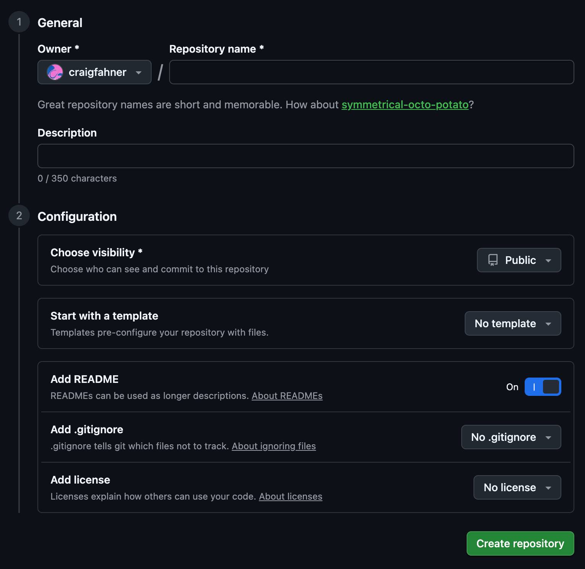

**GitHub**

GitHub provides the infrastructure for this course. It is how I will share assignments and examples with you, and it is how you will submit your own notes and assignments. It also allows you to publish your content to the web easily through something called GitHub Pages.

1. Sign up for a new [GitHub](https://github.com) account. If you already have one, you can either use your existing account or sign up for a new, course-specific account. ([video](https://www.youtube.com/watch?v=ZVRuPO8nCLA)).
2. Download and install [GitHub Desktop](https://desktop.github.com/). ([video](https://www.youtube.com/watch?v=dN5A0kDdCwk)).
3. Log into your new GitHub account from GitHub desktop.

**Creating a course repo**

Everything you do in this course will be contained in one folder. A **GitHub Repository** or "repo" is a folder that you can synchronize to a server. This serves as a version control mechanism, a storage/backup solution, and a method to share and publish your work. Push the below button on the [GitHub](https://github.com) website to create a new repo. I suggest titling your repo INFO-664. 

You will be presented with the following options for creating your new repo. I suggest titling your repo INFO-664. Turn the "add readme" option **on**.

**Cloning your repo to your computer**

1. Once you've logged into your GitHub account on GitHub desktop, "clone" your new repository onto your computer by clicking on the Repository tab in the top left corner, and selecting "Clone Repository" from the "Add" dropdown menu. ([video](https://drive.google.com/file/d/1zXSnRtS_jKpAX98viNRZKXOMZomOmFRM/view?usp=sharing))
2. You will be prompted to select a location on your computer to store the repository. This is where the repo will live on your computer. Once you set this location, _don't move the folder manually_, as it will sever GitHub Desktop's ability to track changes and synchronize. Select a location that you know will remain persistent on your computer.
3. When you click "Clone", a folder will be created on your computer with all the files in the repository. Click "Show in Finder" to navigate to the files themselves.