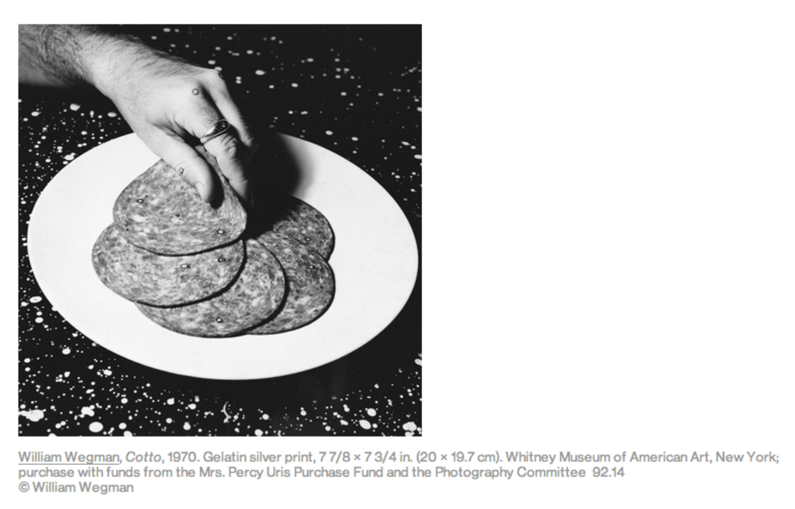





## Part 9: Regular Expressions, JSON parsing, XML parsing

### Saving a CSV file

[Part 7](../part7/) was all about reading CSV files. This part starts with
the other direction: taking a list of dictionaries that we've built or
filtered in Python and **writing** it out as a new CSV file, so it can be
opened in a spreadsheet, shared, or loaded again later.

This example uses a different MoMA file from the
artists list we've been working with: `moma_art.csv`, which has one row
per **artwork** (about 160,000 of them, with 30 columns each, including
`Title`, `Artist`, `Date`, `Medium`, and `Dimensions`). At 69 MB it's too
big to load in the interactive editors on this page, so the three code
blocks below are meant to be run in your own notebook, with [the moma_art CSV](https://github.com/craigfahner/INFO-664/blob/main/week6/moma_art.csv) saved
in the same folder.

**Step 1: load the whole file.** Exactly the same as in Part 7:

```python
import csv   # brings in all the csv-related functions

with open("moma_art.csv", "r", encoding="utf-8") as file:
    reader = csv.DictReader(file)   # read the file as dictionaries
    data = list(reader)             # convert that into a usable list called "data"

print(data[0])   # prints the first dictionary item
```

Which prints:

```text
{'Title': 'Ferdinandsbrücke Project, Vienna, Austria (Elevation, preliminary version)', 'Artist': 'Otto Wagner', 'ConstituentID': '6210', 'ArtistBio': '(Austrian, 1841–1918)', 'Nationality': '(Austrian)', 'BeginDate': '(1841)', 'EndDate': '(1918)', 'Gender': '(male)', 'Date': '1896', 'Medium': 'Ink and cut-and-pasted painted pages on paper', 'Dimensions': '19 1/8 x 66 1/2" (48.6 x 168.9 cm)', 'CreditLine': 'Fractional and promised gift of Jo Carole and Ronald S. Lauder', 'AccessionNumber': '885.1996', 'Classification': 'Architecture', 'Department': 'Architecture & Design', 'DateAcquired': '1996-04-09', 'Cataloged': 'Y', 'ObjectID': '2', 'URL': 'https://www.moma.org/collection/works/2', 'ImageURL': 'https://www.moma.org/media/W1siZiIsIjUyNzc3MCJdLFsicCIsImNvbnZlcnQiLCItcmVzaXplIDEwMjR4MTAyNFx1MDAzZSJdXQ.jpg?sha=712ac0fd74ea5bd5', 'OnView': '', 'Circumference (cm)': '', 'Depth (cm)': '', 'Diameter (cm)': '', 'Height (cm)': '48.6', 'Length (cm)': '', 'Weight (kg)': '', 'Width (cm)': '168.9', 'Seat Height (cm)': '', 'Duration (sec.)': ''}
```

**Step 2: filter it down to a smaller list.** This is the
filter-and-append pattern from [Part 5](../part5/) and
[Part 7](../part7/). The artwork's artist is in the `Artist` column, so
we keep only the rows where it equals `"Yoko Ono"`:

```python
ono_art = []

for artwork in data:
    if artwork['Artist'] == "Yoko Ono":
        ono_art.append(artwork)

print(len(ono_art))   # 93
```

`ono_art` is a list of 93 dictionaries, one per Yoko Ono artwork in the
collection, each with all 30 keys.

**Step 3: write the list out as a new CSV file.**

```python
with open("moma_ono.csv", "w", encoding="utf-8") as file:
    writer = csv.DictWriter(file, ono_art[0].keys())   # new csv from dicts, using all the keys from ono_art
    writer.writeheader()                               # writes a header row for the csv
    writer.writerows(ono_art)                          # writes every dictionary as one row
```

This looks a lot like the reading code, with the pieces swapped around:

- **`open("moma_ono.csv", "w", ...)`**: `"w"` is the *write* mode from the
  [Part 7](../part7/) options table. It creates the file if it doesn't
  exist, and **replaces it** if it does, so be careful not to write over
  something you want to keep.
- **`csv.DictWriter(file, ono_art[0].keys())`** is the counterpart of
  `csv.DictReader`. The second argument is the list of column names to
  write. `ono_art[0]` is the first dictionary in the list, and the
  `.keys()` method gives us all of its keys, which are the 30 column names,
  in their original order.
- **`writer.writeheader()`** writes those column names as the first line
  of the file. Leave it out and the file has no header row, so a
  `DictReader` reading it back would treat the first artwork as the column
  names.
- **`writer.writerows(ono_art)`** takes the whole list and writes one line
  per dictionary. (`writer.writerow(...)`, without the *s*, writes just a
  single dictionary.)

When it finishes, a new file called `moma_ono.csv` appears in the same
folder as your notebook: a header line, plus the 93 artworks. Two things
you might notice if you open it in a text editor:

- It has more than 94 lines. A few of the artworks have a line break
  *inside* a value (a long `Medium` or `CreditLine`), and the writer
  wraps those values in quotes, the same way the `ArtistBio` commas were
  wrapped in Part 7. A spreadsheet or `DictReader` still sees 93 rows.
- Everything is saved as text. A number like `1971` is written the same
  as the string `"1971"`, so when you read the file back in later you'll
  need `int()` again, as in [Part 8](../part8/).

*An option you'll see in other people's code:* `newline=""`, as in
`open("moma_ono.csv", "w", encoding="utf-8", newline="")`. It stops
Python from adding its own line-ending conversion on top of the one the
`csv` module already does. On macOS and Linux it makes no difference, but
on Windows, leaving it out when *writing* can put a blank line between
every row. If you're on Windows and your output file has blank lines in
it, this is why.

**Try it here.** The 93-artwork file that the notebook produced,
`moma_ono.csv`, is small enough to load in the editor. This one reads it
back in, writes the first three artworks out to a *new* file with the same
`DictWriter` steps, and then reads that new file back to check what's in it:

<script type="py-editor" config='{"files": {"{{ ono_url }}": "./moma_ono.csv"}}'>
import csv

with open("moma_ono.csv", "r", encoding="utf-8") as file:
    reader = csv.DictReader(file)
    ono_art = list(reader)

sample = ono_art[:3]

with open("ono_sample.csv", "w", encoding="utf-8") as file:
    writer = csv.DictWriter(file, sample[0].keys())
    writer.writeheader()
    writer.writerows(sample)

with open("ono_sample.csv", "r", encoding="utf-8") as file:
    reader = csv.DictReader(file)
    check = list(reader)

print(len(ono_art))
print(len(check))

for artwork in check:
    print(artwork["Title"], "-", artwork["Date"])
</script>

In the editor, the new file lives in the browser's temporary storage and
disappears when the page reloads. In a Jupyter notebook, it's a real file
you can find next to the notebook.

### Regular expressions: finding patterns in text

Here is a caption from the Whitney Museum's website, for a photograph by
William Wegman:



Say we have thousands of captions like this one and want to pull out the
year, the artist, and the size of each work, to put in a spreadsheet. The
text is stored in a string:

```python
caption = "William Wegman, Cotto, 1970. Gelatin silver print, 7 7/8 × 7 3/4 in. (20 × 19.7 cm). Whitney Museum of American Art, New York; purchase with funds from the Mrs. Percy Uris Purchase Fund and the Photography Committee 92.14 © William Wegman"
```

In [Part 2](../part2/) we picked values out of strings with `in`,
`.find()`, slicing, and `.split()`. Those tools work when we know the
*exact* text, or exactly where something is. But the year here isn't
always going to be `"1970"`, and it isn't always going to be at the same
position. What we know is its **shape**: four digits in a row.

A **regular expression** (or **regex**) is a way of writing down a shape
like that. Python's built-in `re` module reads a regex and finds the text
that fits it. The function we'll use first is `re.search()`:

```python
import re

match = re.search(pattern, text)
```

A few things to know before the first example:

- **`pattern` is a string made of special characters** that describe what
  to look for. Most letters and digits just mean themselves, and the
  special pieces (like `[0-9]`, which means "any digit") each get
  introduced below as we need them.
- **Pattern strings start with `r`**, as in `r"[0-9]{4}"`. The `r` stands for
  *raw*. Normally a backslash in a string is an escape (`"\n"` is a line
  break, from [Part 2](../part2/)), but regexes are full of backslashes of
  their own, and `r` tells Python to leave them alone and pass them to `re`
  exactly as typed.
- **`re.search()` looks through the whole string** and stops at the
  **first** place that fits the pattern. It returns a **match object**
  describing what it found, or the special value `None` if nothing fits.
  `None` is Python's way of saying "no value here."

### Commonly used regular expression patterns

Here is a quick reference for the building blocks you'll see most often.
Each row shows a pattern and some text to search, as in
`re.search(r"c.t", "the cat sat")`, and the last column shows what the
pattern would match. You'll meet most of them in the examples below, and you
can try any row out in [Pythex](https://pythex.org/) (more on that at the end
of this section).

| Character | Description | Example | Sample match |
| --- | --- | --- | --- |
| `.` | Any one character (except a line break) | `c.t` in `the cat sat` | `cat` |
| `\d` | Any one digit, 0 through 9 | `\d\d` in `Room 42` | `42` |
| `\w` | Any one letter, digit, or underscore | `\w\w\w` in `hi there` | `the` |
| `[abc]` | Any one of the characters listed; a range like `[a-z]` or `[0-9]` works too | `[aeiou]` in `gold` | `o` |
| `[^abc]` | Any one character *not* listed | `[^a-z]` in `cat7` | `7` |
| `*` | Zero or more of the thing before it | `ab*` in `abbbc` | `abbb` |
| `+` | One or more of the thing before it | `\d+` in `in 1970` | `1970` |
| `?` | Zero or one of the thing before it (makes it optional) | `colou?r` in `colour` | `colour` (also matches `color`) |
| `{4}` | Exactly that many of the thing before it (`{2,4}` means between 2 and 4) | `\d{4}` in `born 1970` | `1970` |
| `^` | The start of the string | `^Mary` in `Mary Cassatt` | `Mary` (no match in `Saint Mary`) |
| `$` | The end of the string | `\d+$` in `Room 42` | `42` |
| `\b` | A word boundary: the edge of a word or number | `\blove` in `glove love` | `love` (the second one, which starts a word) |
| `( )` | A capture group: marks a part of the match to pull out later with `.group(1)` | `(\d+) cm` in `20 cm` | `20 cm` (group 1 is `20`) |

Most of these characters have a special meaning, which raises the question
of how to match the character itself. Put a backslash in front of it:
`\.` matches an actual period, `\(` an actual opening parenthesis, and `\$`
an actual dollar sign.

### Finding the year

Four digits in a row is written `([0-9]{4})`. Reading it from the inside
out:

- **`[0-9]`** is a **character class**. Square brackets match *one*
  character out of the ones listed inside them, and `0-9` is shorthand for
  "every character from `0` to `9`". So `[0-9]` matches any one digit.
  (`[a-z]` works the same way for lowercase letters.)
- **`{4}`** means "exactly four of the thing before me", so `[0-9]{4}` is
  four digits in a row.
- **`( )`** make a **capture group**. The parentheses don't change what
  gets matched; they mark the part of the pattern whose text we want to
  pull back out afterwards. Here the group wraps the whole pattern, so the
  group is just the year.

```python
import re

match = re.search(r"([0-9]{4})", caption)

print(match)
print(match.group(1))
```

Which prints:

```text
<re.Match object; span=(23, 27), match='1970'>
1970
```

The first line shows what a match object looks like: it records that the
match was found at positions 23 up to 27 in the string, and that the text
there was `'1970'`. `.group(1)` gives us the text matched by the first
capture group, as a string. (`.group()` with no number gives the *whole*
match. They're the same here because our group is the whole pattern, but
they'll be different in the dimensions example below.) Since the result is
a string, we convert it with `int()` (see [Part 8](../part8/)) if we want
to do math with it:

```python
year = int(match.group(1))
print(year + 1)   # 1971
```

<script type="py-editor">
import re

caption = "William Wegman, Cotto, 1970. Gelatin silver print, 7 7/8 × 7 3/4 in. (20 × 19.7 cm). Whitney Museum of American Art, New York; purchase with funds from the Mrs. Percy Uris Purchase Fund and the Photography Committee 92.14 © William Wegman"

match = re.search(r"([0-9]{4})", caption)

print(match)
print(match.group(1))

year = int(match.group(1))
print(year + 1)
</script>

**A shorthand.** Digits turn up in patterns so often that regex has a
shorter way to write `[0-9]`: `\d`. The pattern `([0-9]{4})` and the
pattern `(\d{4})` do exactly the same thing, and from here on we'll use
the shorter `\d`.

**Why not just `\d+`?** The `+` means "one or more of the thing before me",
so `\d+` finds any run of digits, of any length. A caption has lots of
numbers in it. `re.findall()` is like `re.search()`, except that it
returns a **list of every match** instead of just the first one, which
makes it a good way to see what a pattern is picking up:

```python
print(re.findall(r"\d+", caption))
```

```text
['1970', '7', '7', '8', '7', '3', '4', '20', '19', '7', '92', '14']
```

That's every number in the caption: the year, the inches, the centimetres
(`19.7` is split in two around the decimal point), and the accession
number `92.14`. Asking for exactly four digits, `\d{4}`, is what singles
out the year.

**Tightening it up.** `\d{4}` has one weakness: it happily matches four
digits from the *middle* of a longer number.

```python
print(re.search(r"\d{4}", "Item 123456 was made in 1970").group())      # 1234
print(re.search(r"\b\d{4}\b", "Item 123456 was made in 1970").group())  # 1970
```

`\b` matches a **word boundary**: the invisible line between a letter or
digit and anything that isn't one (a space, a comma, the start or end of
the string). Putting `\b` on both sides says "four digits, with nothing
else stuck to either end," which skips `123456` and finds `1970`. It's
worth including whenever you're searching for a number inside bigger
chunks of text.

<script type="py-editor">
import re

print(re.search(r"\d{4}", "Accession 123456 was made in 1970").group())
print(re.search(r"\b\d{4}\b", "Accession 123456 was made in 1970").group())
</script>

### Finding the artist's name

The artist's name is the first thing in the caption, followed by a comma.
There's no fixed shape to a *name* (how long is it, how many words), but
we do know where it ends: at the first comma. So the pattern describes
"everything from the start up to the first comma":

```python
match = re.search(r"^[^,]+", caption)

print(match.group())   # William Wegman
```

Reading `^[^,]+` one piece at a time:

- **`^`** means "the start of the string". The match has to begin right
  there.
- **`[ ]`** is a **character class**: it matches *one* character, out of
  the ones listed between the brackets. `[aeiou]` would match any one
  vowel.
- **`[^,]`**: a `^` just inside the opening bracket flips the class, so
  `[^,]` matches any one character that is **not** a comma. (This `^` is a
  different job from the `^` at the very start of the pattern, which is why
  the same symbol appears twice.)
- **`+`** means "one or more of the thing before me", so `[^,]+` keeps
  grabbing non-comma characters until it hits a comma, or the end of the
  string.

Put together: starting at the beginning, take everything until the first
comma. That's `William Wegman`.

A fair question is why we wouldn't just write `caption.split(",")[0]`,
the way we did in [Part 2](../part2/). For this one caption, we could, and
it would give the same answer. A regex starts to pay off when the text
is messier, or when we want to combine several conditions, as in the next
example.

<script type="py-editor">
import re

caption = "William Wegman, Cotto, 1970. Gelatin silver print, 7 7/8 × 7 3/4 in. (20 × 19.7 cm). Whitney Museum of American Art, New York; purchase with funds from the Mrs. Percy Uris Purchase Fund and the Photography Committee 92.14 © William Wegman"

match = re.search(r"^[^,]+", caption)
print(match.group())

print(caption.split(",")[0])
</script>

### Advanced: Finding the dimensions in centimetres (bonus)

The size appears twice, once in inches and once in centimetres:
`7 7/8 × 7 3/4 in. (20 × 19.7 cm)`. We want the centimetre version, which
is the one in parentheses, and we want the two numbers separately. The
pattern for that is:

```python
match = re.search(r"\(([\d.]+) [x×] ([\d.]+) cm\)", caption)

print(match.group())    # (20 × 19.7 cm)
print(match.group(1))   # 20
print(match.group(2))   # 19.7
print(match.groups())   # ('20', '19.7')
```

This is the most complicated pattern so far, so here it is in pieces:

- **`\(` and `\)`**: in a regex, parentheses have a special meaning (see
  below), so to match an actual `(` or `)` in the text we put a backslash
  in front. This is called **escaping** a character.
- **`( )` (unescaped)** make **capture groups**, like the one around the
  year. This pattern has two, one around each number, so Python remembers
  each piece separately: `.group(1)` is the first number and `.group(2)` is
  the second. `.group()` with no number is still the *whole* match,
  including the parentheses and the `cm`, and `.groups()` gives all the
  groups at once, as a tuple.
- **`[\d.]+`**: a character class that allows digits (`\d`) *or* a period,
  repeated one or more times. That's how it handles both `20` and `19.7`.
  (Inside `[ ]`, a `.` is just an ordinary period.)
- **`[x×]`**: another character class, this time matching either the
  letter `x` or the multiplication sign `×`. The caption on the Whitney's
  page uses the real `×` symbol, but plenty of other sources type a
  plain letter `x` instead, so the pattern accepts both.
- **` cm`** and the spaces are literal: they match themselves.

The numbers in inches don't match, because they're followed by ` in.)`
and not ` cm)`. The `cm` is what makes the pattern find the right pair.

The groups come back as strings, so as before we convert them with
`float()` (since `19.7` has a decimal) to use them as numbers:

```python
height = float(match.group(1))
width = float(match.group(2))

print(f"{height} cm tall and {width} cm wide")   # 20.0 cm tall and 19.7 cm wide
```

(Museum captions conventionally list height first, then width.)

One more habit worth building: `re.search()` returns `None` when nothing
matches, and calling `.group()` on `None` is an error. When searching text
you haven't checked by hand, test the result with an `if` first:

```python
match = re.search(r"\(([\d.]+) [x×] ([\d.]+) cm\)", caption)

if match:
    height = float(match.group(1))
    width = float(match.group(2))
    print(f"{height} cm tall and {width} cm wide")
else:
    print("no dimensions found")
```

<script type="py-editor">
import re

caption = "William Wegman, Cotto, 1970. Gelatin silver print, 7 7/8 × 7 3/4 in. (20 × 19.7 cm). Whitney Museum of American Art, New York; purchase with funds from the Mrs. Percy Uris Purchase Fund and the Photography Committee 92.14 © William Wegman"

match = re.search(r"\(([\d.]+) [x×] ([\d.]+) cm\)", caption)

if match:
    print(match.group())
    print(match.groups())

    height = float(match.group(1))
    width = float(match.group(2))
    print(f"{height} cm tall and {width} cm wide")
else:
    print("no dimensions found")
</script>

Try deleting the `cm` from the pattern to see what changes, or change it
to `in\.` and see which numbers it finds instead.

### Wildcards: finding every "love" in the Meet the Beatles tracklist

Back in [Part 5](../part5/) we filtered Beatles track titles for the word
"love". Matching the exact letters `l-o-v-e` missed "Loving", and we had to
work around it by checking for `" lov"` with a space glued on the front to
find the start of a word. Regular expressions have tools built for this
kind of problem, called **wildcards**: pattern pieces that stand for *any*
of a group of characters.

- **`.`** matches any one character (except a line break).
- **`\w`** matches any one *word* character: a letter, a digit, or an
  underscore.
- **`*`** means "zero or more of the thing before me", which makes
  `\w*` "any number of word characters in a row, including none."

So `lov\w*` means "the letters `lov`, followed by the rest of the word,
however long it is". That one pattern fits `love`, `loving`, `lovely`, and
so on. To also catch a capital `L`, we use a character class, as in the
last section: `[Ll]ov\w*`.

Let's try the pattern on a few test words before using it on real data,
the same thing you'd do in a regex-testing tool (more on those below).
Two versions of the pattern run side by side: the plain one, and one with
`\b` (from the year example) at the front:

```python
test_words = ["Love", "Loving", "love", "lovely", "glove", "beloved"]

for word in test_words:
    plain = re.search(r"[Ll]ov\w*", word)
    with_boundary = re.search(r"\b[Ll]ov\w*", word)
    print(word, "|", bool(plain), "|", bool(with_boundary))
```

Which prints:

```text
Love | True | True
Loving | True | True
love | True | True
lovely | True | True
glove | True | False
beloved | True | False
```

(`bool()`, from [Part 1](../part1/), turns a match into `True` and `None`
into `False`.) The plain pattern finds `love` hiding *inside* `glove` and
`beloved`, which we don't want. Adding `\b` means the match has to start at
the beginning of a word, so only the first four count.

<script type="py-editor">
import re

test_words = ["Love", "Loving", "love", "lovely", "glove", "beloved"]

for word in test_words:
    plain = re.search(r"[Ll]ov\w*", word)
    with_boundary = re.search(r"\b[Ll]ov\w*", word)
    print(word, "|", bool(plain), "|", bool(with_boundary))
</script>

Now the real data. Here is the track listing of *Meet the Beatles!*, the
1964 American release, as a list (from [Part 3](../part3/)). We loop over
it with the same filter-and-append pattern from Part 5, but where Part 5
used `in`, the condition is now `re.search()`. Since `None` counts as
`False` in an `if` and a match counts as `True`, we can use the result
directly as the condition:

```python
import re

meet_the_beatles = [
    "I Want to Hold Your Hand", "I Saw Her Standing There", "This Boy",
    "It Won't Be Long", "All I've Got to Do", "All My Loving",
    "Don't Bother Me", "Little Child", "Till There Was You",
    "Hold Me Tight", "I Wanna Be Your Man", "Not a Second Time",
]

love_songs = []

for track in meet_the_beatles:
    if re.search(r"\b[Ll]ov\w*", track):
        love_songs.append(track)

print(love_songs)
```

Which prints:

```text
['All My Loving']
```

Only one of the twelve tracks fits. The album really does have just one
love song by title, so that's the right answer, and not a bug in the
pattern. We can also use the wildcard to pull out the *word* that matched,
not just the title it was in, by calling `.group()` on the match:

```python
for track in love_songs:
    match = re.search(r"\b[Ll]ov\w*", track)
    print(track, "->", match.group())   # All My Loving -> Loving
```

<script type="py-editor">
import re

meet_the_beatles = [
    "I Want to Hold Your Hand", "I Saw Her Standing There", "This Boy",
    "It Won't Be Long", "All I've Got to Do", "All My Loving",
    "Don't Bother Me", "Little Child", "Till There Was You",
    "Hold Me Tight", "I Wanna Be Your Man", "Not a Second Time",
]

love_songs = []

for track in meet_the_beatles:
    if re.search(r"\b[Ll]ov\w*", track):
        love_songs.append(track)

print(love_songs)

for track in love_songs:
    match = re.search(r"\b[Ll]ov\w*", track)
    print(track, "->", match.group())
</script>

**`.` and `.*` versus `\w*`.** The dot is the most general wildcard: `.*`
means "any characters at all, any number of them". It's tempting, but it
doesn't stop at the end of a word. Compare the two on a title from another
album, *P.S. I Love You*:

```python
print(re.search(r"[Ll]ov.*", "P.S. I Love You").group())    # Love You
print(re.search(r"[Ll]ov\w*", "P.S. I Love You").group())   # Love
```

`.*` keeps going to the end of the string, spaces and all, while `\w*`
stops at the first character that isn't part of a word. Which one you want
depends on whether you're hunting for a word or for "everything after this
point".

<script type="py-editor">
import re

print(re.search(r"[Ll]ov.*", "P.S. I Love You").group())
print(re.search(r"[Ll]ov\w*", "P.S. I Love You").group())
</script>

**Ignoring case another way.** `[Ll]` works for one letter, but for a
longer word, listing every upper and lower case pair gets tedious. A third
argument, `re.IGNORECASE`, makes the whole pattern case-insensitive, so
`LOVE`, `Love`, and `love` all match:

```python
print(re.search(r"\blov\w*", "LOVE ME", re.IGNORECASE).group())   # LOVE
```

<script type="py-editor">
import re

print(re.search(r"\blov\w*", "LOVE ME", re.IGNORECASE).group())
</script>

### Testing patterns and learning more

Regular expressions are famously easy to get *almost* right. Two free
resources are worth bookmarking:

- **[Pythex](https://pythex.org/)** is a web page for trying out Python
  regular expressions. Paste in your test string, type a pattern, and it
  highlights what matches as you type, so you can adjust a pattern until
  it finds exactly what you want *before* putting it in your code. Try
  pasting in the Wegman caption and rebuilding the three patterns from this
  part.
- **[Python's `re` module documentation](https://docs.python.org/3/library/re.html)**
  is the deep dive: every special character, flag, and function, with
  examples. It's a reference, not a tutorial, so it's better to look
  things up in it than to read it start to finish.

Here is a summary of the pieces used in this part:

| Pattern | Matches |
| --- | --- |
| `\d` | any one digit |
| `\w` | any one letter, digit, or underscore |
| `.` | any one character (except a line break) |
| `[abc]` | any one of the characters listed (`a`, `b`, or `c`) |
| `[0-9]` | any one character in the range listed (here, any digit); `\d` is a shorthand for this |
| `[^,]` | any one character *except* the ones listed (here, a comma) |
| `^` | the start of the string |
| `\b` | a word boundary (the edge of a word or number) |
| `*` | zero or more of the thing before it |
| `+` | one or more of the thing before it |
| `{4}` | exactly four of the thing before it |
| `\(` `\)` | a literal parenthesis (a backslash escapes a special character) |
| `( )` | a capture group, retrievable with `.group(1)`, `.group(2)`, ... |

And the `re` functions we've used:

| Function | What it returns |
| --- | --- |
| `re.search(pattern, text)` | a match object for the first match, or `None` |
| `re.findall(pattern, text)` | a list of every match |
| `match.group()` | the matched text (`.group(1)`, `.group(2)` for capture groups) |
| `match.groups()` | all the capture groups, as a tuple |

### Parsing JSON data

CSV isn't the only common format for datasets. **JSON** (JavaScript Object
Notation) is the format most websites and web APIs use to hand data over,
and it should look familiar: it's built out of the same pieces as the
lists and dictionaries from [Part 3](../part3/). Curly braces hold
`"key": value` pairs, square brackets hold lists, and the two can nest
inside each other as deep as they need to.

The example uses `unesco_cultural_sites.json` from the week 6 folder: the
UNESCO World Heritage List's cultural sites, 991 of them. Each site is one
dictionary with 54 keys (names in six languages, descriptions, dates,
coordinates, and more). Here is the first site, trimmed down to a few of
those keys:

```json
{
  "name_en": "Aalto Works",
  "date_inscribed": "2026",
  "danger": "False",
  "category": "Cultural",
  "states_names": ["Finland"],
  "region": "Europe and North America"
}
```

**Loading it.** Python's built-in `json` module does for JSON what `csv`
did for CSV. `json.load()` reads the whole file and converts it into the
Python equivalent: here, a list of dictionaries, the same shape as the
`data` we got from `csv.DictReader` in [Part 7](../part7/):

```python
import json

with open("unesco_cultural_sites.json", "r", encoding="utf-8") as file:
    sites = json.load(file)

print(type(sites))                # <class 'list'>
print(len(sites))                 # 991
print(sites[0]["name_en"])        # Aalto Works
print(sites[0]["states_names"])   # ['Finland']
```

Because JSON keeps its structure, values aren't all strings the way CSV
values were. `states_names` came back as a real Python list, so we could
index into it with `sites[0]["states_names"][0]` to get `Finland`.

**Finding the endangered sites.** UNESCO flags a site as in danger with
the `danger` key. This is the same filter-and-print loop as before:
loop over the list, test each site with an `if`, and print an f-string for
the ones that match:

```python
for site in sites:
    if site["danger"] == "True":
        site_name = site["name_en"]
        region = site["region"]
        print(f"{site_name} is an endangered cultural heritage site in {region}")
```

Which prints (the first five of 43 lines):

```text
Mount Amel Castles is an endangered cultural heritage site in Arab States
Sebastia is an endangered cultural heritage site in Arab States
Saint Hilarion Monastery/ Tell Umm Amer is an endangered cultural heritage site in Arab States
The Historic Centre of Odesa is an endangered cultural heritage site in Europe and North America
Rachid Karami International Fair-Tripoli is an endangered cultural heritage site in Arab States
```

Two details in that `if` are easy to trip over:

- **The key is lowercase.** `site["danger"]` works and `site["Danger"]`
  raises a `KeyError`, because dictionary keys are case-sensitive, in JSON
  as in Python. When a lookup fails, print `sites[0].keys()` to see what the
  keys are actually called.
- **The value is the *string* `"True"`.** In this file the flag is stored
  as text, in quotes, the same way CSV stored everything as text. A real
  boolean `True` (no quotes, from [Part 1](../part1/)) is not equal to the
  string `"True"`, so `site["danger"] == True` never matches anything and
  the loop prints nothing at all. Comparing against the string
  `"True"` finds all 43. Not every JSON file does this (many store a real
  `true`, which loads as a Python `True`), so check what a value looks like
  before writing the comparison.

<script type="py-editor" config='{"files": {"{{ unesco_url }}": "./unesco_cultural_sites.json"}}'>
import json

with open("unesco_cultural_sites.json", "r", encoding="utf-8") as file:
    sites = json.load(file)

print(type(sites))
print(len(sites))
print(sites[0]["name_en"])
print(sites[0]["states_names"])

for site in sites:
    if site["danger"] == "True":
        site_name = site["name_en"]
        region = site["region"]
        print(f"{site_name} is an endangered cultural heritage site in {region}")
</script>

The file is 18 MB, so the editor can take a few seconds to load it the
first time. Try changing `region` to `site["states_names"][0]` to name the
country instead, or change the test to `site["transboundary"] == "True"` to
find sites that span more than one country.

### XML (bonus)

CSV and JSON are the two formats you'll run into most often with
open-access datasets. A third, **XML** (eXtensible Markup Language), is
older and wordier, but it's still the standard in many libraries and
archives. The Library of Congress and the New York Public Library, for
example, publish catalogue records as XML, in library metadata standards
like [MODS](https://www.loc.gov/standards/mods/userguide/examples.html) and [MARCXML](https://www.loc.gov/standards/marcxml/). If you work with library or archive data, sooner or
later you'll be handed some.

The example is `loc_book.xml` from the week 6 folder: the Library of
Congress catalogue record for a single book, in MODS format. XML stores
data in **elements**, each wrapped in an opening tag and a closing tag,
like `<title>...</title>`. Elements can sit inside other elements, which is
how XML builds the same kind of nested structure as the dictionaries and
lists in JSON. Here is a trimmed excerpt of the record:

```xml
<mods xmlns="http://www.loc.gov/mods/v3" version="3.5">

  <titleInfo>
    <title>Sound and fury</title>
    <subTitle>the making of the punditocracy</subTitle>
  </titleInfo>

  <name type="personal">
    <namePart>Alterman, Eric</namePart>
    <role>
      <roleTerm type="text">creator</roleTerm>
    </role>
  </name>

  <originInfo eventType="publication">
    <publisher>Cornell University Press</publisher>
    <dateIssued>c1999</dateIssued>
    <dateIssued encoding="marc">1999</dateIssued>
  </originInfo>

</mods>
```

A few terms for reading it:

- **Text** is whatever sits between an element's opening and closing tags:
  `Sound and fury` is the text of the `<title>` element.
- **Children** are the elements nested inside another one. `<title>` is a
  child of `<titleInfo>`, which is a child of the top-level `<mods>`
  element (the **root**).
- **Attributes** are the `name="value"` pieces inside an opening tag, like
  `encoding="marc"` on the second `<dateIssued>`. They add extra
  information about the element.

**Loading it.** Python's built-in `xml.etree.ElementTree` module reads XML.
It has a long name, so it's usually imported with `as ET`, which gives it a
short nickname (the same `as` that gave us `file` in `with open(...) as
file`). `ET.parse()` reads the file, and `.getroot()` hands back the root
element, the top of the tree that everything else hangs off of:

```python
import xml.etree.ElementTree as ET

tree = ET.parse("loc_book.xml")
root = tree.getroot()

print(root.tag)
```

Which prints:

```text
{http://www.loc.gov/mods/v3}mods
```

That's not just `mods`. The `xmlns="http://www.loc.gov/mods/v3"` on the
root element in the file declares a **namespace**: a web address that
labels which vocabulary the tags come from (here, the Library of Congress's
MODS standard), so tags from different standards can't be confused. The
catch is that Python includes that address in front of every tag name in
the file. To search for `title`, we'd have to write out
`{http://www.loc.gov/mods/v3}title`.

That would get tedious, so we give the address a short nickname, in a
dictionary, and use the nickname in our searches:

```python
ns = {"mods": "http://www.loc.gov/mods/v3"}
```

`"mods"` is a name we picked. It could be anything, as long as the address
next to it matches the one in the file exactly.

**Finding elements.** `root.find()` searches for an element by its path of
nested tag names, separated by slashes, and returns the first one it finds.
Passing `ns` as the second argument tells it what `mods:` stands for. The
`.text` attribute then gives us the text inside the element:

```python
title = root.find("mods:titleInfo/mods:title", ns).text
author = root.find("mods:name/mods:namePart", ns).text

print(title)    # Sound and fury
print(author)   # Alterman, Eric
```

The path `mods:titleInfo/mods:title` reads as "start at the root, go into
`titleInfo`, then into its `title`." The author's name is stored under
`name`, then `namePart`.

**The publication date.** A catalogue record often holds the same fact in
more than one form, and this one does: there are *two* `<dateIssued>`
elements. If we search for it the same way, `find()` returns the first one:

```python
date = root.find("mods:originInfo/mods:dateIssued", ns).text

print(date)   # c1999
```

`c1999` is the date as printed on the book (the `c` stands for
"copyright"). The second one, tagged `encoding="marc"`, is the clean,
machine-readable year. We can ask for it by adding the attribute in square
brackets, `[@encoding='marc']`, right after the tag name, which means "the
`dateIssued` element whose `encoding` attribute is `marc`":

```python
date = root.find("mods:originInfo/mods:dateIssued[@encoding='marc']", ns).text

print(date)   # 1999
```

**Putting it in an f-string.** Library records usually write a name as
`Last, First`. We can flip it around with `.split()` (from
[Part 2](../part2/)), then build the sentence:

```python
last_name, first_name = author.split(", ")

print(f'"{title}" by {first_name} {last_name}, published in {date}')
```

Which prints:

```text
"Sound and fury" by Eric Alterman, published in 1999
```

<script type="py-editor" config='{"files": {"{{ loc_url }}": "./loc_book.xml"}}'>
import xml.etree.ElementTree as ET

tree = ET.parse("loc_book.xml")
root = tree.getroot()

print(root.tag)

ns = {"mods": "http://www.loc.gov/mods/v3"}

title = root.find("mods:titleInfo/mods:title", ns).text
author = root.find("mods:name/mods:namePart", ns).text
date = root.find("mods:originInfo/mods:dateIssued[@encoding='marc']", ns).text

last_name, first_name = author.split(", ")

print(f'"{title}" by {first_name} {last_name}, published in {date}')
</script>

Two things to know when a search doesn't work:

- **`find()` returns `None` if nothing matches**, and then `.text` raises an
  `AttributeError` ("'NoneType' object has no attribute 'text'"). The most
  common cause is forgetting the `ns` argument, or the `mods:` before a tag
  name. Try deleting `, ns` from one of the lines above to see it happen.
- **`find()` only returns the first match.** To get *every* match, use
  `root.findall()`, which returns a list of elements. Each `<subject>` in
  this record has its own `<topic>` elements, so
  `root.findall("mods:subject/mods:topic", ns)` finds all of the book's
  topic headings. Loop over the list and print each one's `.text` to see
  them.
