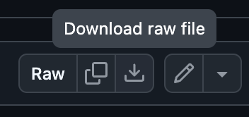

## Week 4 activities

* [Another CSV parsing example from Filipa Calado's section](https://gofilipa.github.io/664/csv/)
* [Logic tutorial from Filipa Calado's 664 section](https://gofilipa.github.io/664/logic/)
* [Custom functions tutorial (Melanie Walsh)](https://melaniewalsh.github.io/Intro-Cultural-Analytics/02-Python/12-Functions.html)
* [Comparisons and conditionals tutorial (Melanie Walsh)](https://melaniewalsh.github.io/Intro-Cultural-Analytics/02-Python/08-Comparisons-Conditionals.html)


### Copy-and-paste snippets

copy and paste the below lists so you don't have to worry about typing them out during lecture!

```
beatles_albums = [
    {
        "album_title": "Please Please Me",
        "release_date": "22 March 1963",
        "running_time": "31:59",
        "running_time_in_seconds": 1919,
        "tracks": ["I Saw Her Standing There", "Misery", "Anna (Go to Him)",
                   "Chains", "Boys", "Ask Me Why", "Please Please Me",
                   "Love Me Do", "P.S. I Love You", "Baby It's You",
                   "Do You Want to Know a Secret", "A Taste of Honey",
                   "There's a Place", "Twist and Shout"],
    },
    {
        "album_title": "With the Beatles",
        "release_date": "22 November 1963",
        "running_time": "33:07",
        "running_time_in_seconds": 1987,
        "tracks": ["It Won't Be Long", "All I've Got to Do", "All My Loving",
                   "Don't Bother Me", "Little Child", "Till There Was You",
                   "Please Mister Postman", "Roll Over Beethoven", "Hold Me Tight",
                   "You Really Got a Hold on Me", "I Wanna Be Your Man",
                   "Devil in Her Heart", "Not a Second Time",
                   "Money (That's What I Want)"],
    },
    {
        "album_title": "A Hard Day's Night",
        "release_date": "10 July 1964",
        "running_time": "30:09",
        "running_time_in_seconds": 1809,
        "tracks": ["A Hard Day's Night", "I Should Have Known Better", "If I Fell",
                   "I'm Happy Just to Dance with You", "And I Love Her", "Tell Me Why",
                   "Can't Buy Me Love", "Any Time at All", "I'll Cry Instead",
                   "Things We Said Today", "When I Get Home", "You Can't Do That",
                   "I'll Be Back"],
    },
]


```

**Download the MoMA Artists CSV**

Navigate to [this CSV file in the course repo](https://github.com/craigfahner/INFO-664/blob/main/notebooks/moma_artists.csv).

Click on the "Download raw file" button and move the file into the Week 4 folder of your own GitHub repo



### Homework: 

1. **Loops**: Make a list of numbers (ie [1,4,6,8,3]). Using a `for` loop, print an f-string for each number that states the square of each number in the list, by multiplying the number by its own value. IE: `The square of {i} is {i*i}`
2. **Conditionals**: using the same list of numbers, nest an `if` statement in a `for` loop that goes through each number in the list. the `if` statement should check whether the number is even or odd, and will print `{i} is even` or `{i} is odd` respectively. Hint: use the `%` (modulo) operator to figure out if a number is even or odd. See [this tutorial](https://www.geeksforgeeks.org/python/what-is-a-modulo-operator-in-python/) for more info.
3. **CSV** (bonus): Using the MoMA CSV, count how many male artists are represented vs female artists vs non-binary artists. This will require you to
- Read the dataset as a dictionary list
- Filter that list to only include entries that have Gender data, by creating a new variable (ie `artists_with_gender_data = []`)
- Filter that list into three new lists using a for loop (which goes through each artist in the list), and an if/elif conditional that appends the given artist to the respective `male_artists`, `female_artists`, and `non_binary_artists` lists, based on whether the gender field matches. You may also want to create an `other_artists` field for entries that don't match the criteria, using the `else` condition.
- Produce a count for each of those lists using the `len()` function
- Print the results into a cleanly-formatted f-string